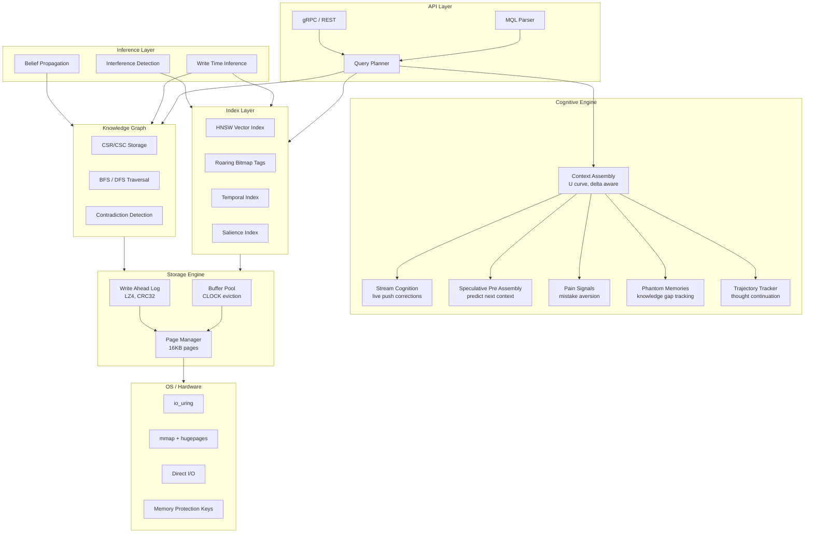

# MenteDB

**The Mind Database for AI Agents**

MenteDB is a purpose built database engine for AI agent memory. Not a wrapper around existing databases, but a ground up Rust storage engine that understands how AI/LLMs consume data.

> *mente* (Spanish): mind, intellect

## Why MenteDB?

Every database ever built assumes the consumer can compensate for bad data organization. **AI can't.** A transformer gets ONE SHOT, a single context window, a single forward pass. MenteDB is a *cognition preparation engine* that delivers perfectly organized knowledge because the consumer has no ability to reorganize it.

### What Makes MenteDB Different

| Feature | Traditional DBs | Vector DBs | MenteDB |
|---------|----------------|------------|---------|
| Storage model | Tables/Documents | Embeddings | Memory nodes (embeddings + graph + temporal + attributes) |
| Query result | Raw data | Similarity scores | **Token budget optimized context windows** |
| Understands AI attention? | No | No | **Yes, attention aware ordering** |
| Tracks what AI knows? | No | No | **Yes, epistemic state tracking** |
| Updates cascade? | Foreign keys | No | **Yes, belief propagation** |
| Multi-agent isolation? | Schema level | Collection level | **Memory spaces with MPK accelerated isolation** |

### Core Features

- **Unified Memory Representation** Embeddings + graph + temporal + attributes in one primitive
- **Attention Optimized Context Assembly** Respects the U curve (critical data at start/end)
- **Belief Propagation** When facts change, downstream beliefs are flagged for re evaluation
- **Delta Aware Serving** Only sends what changed since last turn (40-60% token savings)
- **Cognitive Memory Tiers** Working, Episodic, Semantic, Procedural, Archival
- **Token Efficient Serialization** 3x more information per token vs JSON
- **Memory Spaces** True multi agent isolation with hardware accelerated protection
- **MQL** Mente Query Language designed for memory retrieval

### Performance Targets (10M memories)

| Operation | Target |
|-----------|--------|
| Point lookup | ~50ns |
| Multi-tag filter | ~10μs |
| k-NN similarity search | ~5ms |
| Full context assembly | <50ms |
| Startup (mmap) | <1ms |

## Architecture



## Crates

MenteDB is organized as a Cargo workspace with 10 crates:

| Crate | Description |
|-------|-------------|
| `mentedb` | Facade crate, the single public entry point for embedding MenteDB |
| `mentedb-core` | Fundamental types: MemoryNode, MemoryEdge, errors, MVCC, event bus |
| `mentedb-storage` | Page based storage engine with WAL, buffer pool, and LZ4 compression |
| `mentedb-index` | HNSW vector index, roaring bitmap tags, temporal and salience indexes |
| `mentedb-graph` | CSR/CSC knowledge graph with BFS/DFS traversal and contradiction detection |
| `mentedb-query` | MQL parser, AST, and query planner |
| `mentedb-context` | Attention aware context assembly with U curve ordering and delta tracking |
| `mentedb-cognitive` | Cognitive engine: belief propagation, pain signals, phantom memories, speculative cache |
| `mentedb-consolidation` | Memory consolidation: temporal decay, salience updates, archival |
| `mentedb-server` | gRPC/REST server layer |

## Configuration

MenteDB is configured via a JSON file. All sections are optional; omitted fields use sensible defaults.

```json
{
  "storage": {
    "data_dir": "/var/mentedb/data",
    "buffer_pool_size": 1024,
    "page_size": 16384
  },
  "index": {
    "hnsw_m": 16,
    "hnsw_ef_construction": 200,
    "hnsw_ef_search": 50
  },
  "context": {
    "default_token_budget": 4096,
    "token_multiplier": 1.3,
    "zone_system_pct": 0.10,
    "zone_critical_pct": 0.25,
    "zone_primary_pct": 0.35,
    "zone_supporting_pct": 0.20,
    "zone_reference_pct": 0.10
  },
  "cognitive": {
    "contradiction_threshold": 0.95,
    "related_threshold_min": 0.6,
    "related_threshold_max": 0.85,
    "interference_threshold": 0.8,
    "speculative_cache_size": 10,
    "speculative_hit_threshold": 0.5,
    "max_trajectory_turns": 100,
    "max_pain_warnings": 5,
    "max_phantom_warnings": 5
  },
  "consolidation": {
    "decay_half_life_hours": 168.0,
    "min_salience": 0.01,
    "archival_min_age_days": 30,
    "archival_max_salience": 0.05
  },
  "server": {
    "host": "0.0.0.0",
    "port": 6677
  }
}
```

Load configuration in Rust:

```rust
use mentedb_core::MenteConfig;
let config = MenteConfig::from_file(std::path::Path::new("mentedb.json")).unwrap();
```

## MQL Examples

MQL (Mente Query Language) is the native query language for memory retrieval.

```sql
-- Vector similarity search: find the 10 memories closest to an embedding
RECALL memories NEAR [0.12, 0.45, 0.78, 0.33] LIMIT 10

-- Filtered recall: episodic memories tagged "backend"
RECALL memories WHERE type = episodic AND tag = "backend" LIMIT 5

-- Content similarity: fuzzy match on content text
RECALL memories WHERE content ~> "database migration strategies" LIMIT 10

-- Graph traversal: walk causal edges up to depth 3
TRAVERSE 550e8400-e29b-41d4-a716-446655440000 DEPTH 3 WHERE edge_type = caused

-- Consolidation: archive stale episodic memories
CONSOLIDATE WHERE type = episodic AND accessed < "2024-01-01"
```

## Benchmarks

Run `cargo bench` to benchmark storage writes, HNSW search, context assembly, and MQL parsing.

## Building

```bash
cargo build
cargo test
```

## License

Apache 2.0, see [LICENSE](LICENSE) for details.
