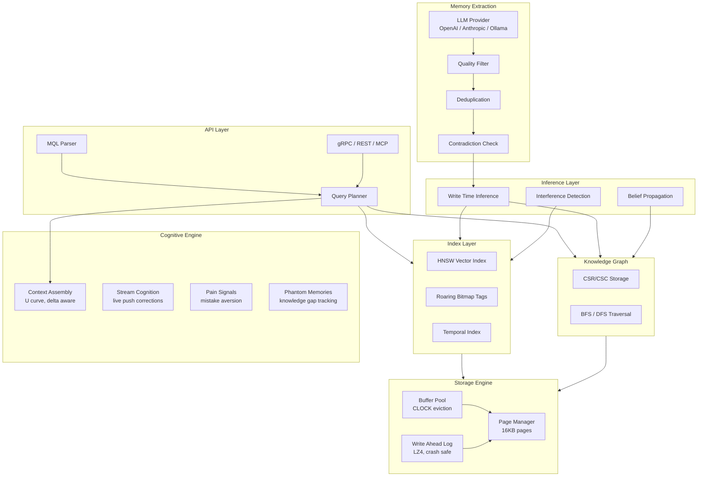

# MenteDB

> ⚠️ **Beta** — MenteDB is under active development. APIs may change between minor versions.

[](https://crates.io/crates/mentedb-core) [](https://docs.rs/mentedb-core) [](https://github.com/nambok/mentedb/actions/workflows/ci.yml) [](LICENSE) [](https://www.npmjs.com/package/mentedb) [](https://pypi.org/project/mentedb/)

**The Mind Database for AI Agents**

MenteDB is a purpose built database engine for AI agent memory. Not a wrapper around existing databases, but a ground up Rust storage engine that understands how AI/LLMs consume data.

> *mente* (Spanish): mind, intellect

## Quick Start

**Just remember a conversation:**

```bash
# Via REST API
curl -X POST http://localhost:6677/v1/ingest \
  -H "Content-Type: application/json" \
  -d '{"conversation": "User: I prefer Python over JS\nAssistant: Noted!", "agent_id": "my-agent"}'

# Response: { "memories_stored": 2, "rejected_low_quality": 5, "contradictions": 0 }
```

**Via MCP (Claude CLI, Copilot CLI, Cursor):**

```json
// claude_desktop_config.json
{
  "mcpServers": {
    "mentedb": {
      "command": "mentedb-mcp",
      "args": ["--data-dir", "~/.mentedb"]
    }
  }
}
```

Then the AI can call `ingest_conversation` directly. No manual memory structuring needed.

**Embed in Rust:**

```rust
use mentedb::MenteDb;

let db = MenteDb::open("./my-agent-memory")?;
db.store(&memory_node)?;
let context = db.assemble_context(agent_id, space_id, 4096)?;
```

## Why MenteDB?

Every database ever built assumes the consumer can compensate for bad data organization. **AI can't.** A transformer gets ONE SHOT, a single context window, a single forward pass. MenteDB is a *cognition preparation engine* that delivers perfectly organized knowledge because the consumer has no ability to reorganize it.

### The Memory Quality Problem

Most AI memory tools store everything and retrieve by similarity. The result: **context windows full of noise.** Studies show up to 97% of automatically stored memories are irrelevant.

MenteDB solves this with **write time intelligence:**

1. **LLM Powered Extraction** parses conversations and extracts only what matters: decisions, preferences, corrections, facts, entities
2. **Quality Filtering** rejects low confidence extractions before they hit storage
3. **Deduplication** checks embedding similarity against existing memories
4. **Contradiction Detection** flags when new information conflicts with existing beliefs
5. **Belief Propagation** cascades updates when facts change

The result: a clean, curated memory that actually helps the AI perform better.

### What Makes MenteDB Different

| Feature | Traditional DBs | Vector DBs | Mem0/Zep | MenteDB |
|---------|----------------|------------|----------|---------|
| Storage model | Tables/Documents | Embeddings | Key value | Memory nodes (embeddings + graph + temporal) |
| Query result | Raw data | Similarity scores | Raw memories | **Token budget optimized context** |
| Memory quality | Manual | None | LLM extract | **LLM extract + quality filter + dedup + contradiction** |
| Understands AI attention? | No | No | No | **Yes, U curve ordering** |
| Tracks what AI knows? | No | No | No | **Epistemic state tracking** |
| Multi-agent isolation? | Schema level | Collection level | API key | **Memory spaces with ACLs** |
| Updates cascade? | Foreign keys | No | No | **Belief propagation** |

### Core Features

- **Automatic Memory Extraction** LLM powered pipeline extracts structured memories from raw conversations
- **Write Time Intelligence** Quality filter, deduplication, and contradiction detection at ingest
- **Attention Optimized Context Assembly** Respects the U curve (critical data at start/end of context)
- **Belief Propagation** When facts change, downstream beliefs are flagged for re evaluation
- **Delta Aware Serving** Only sends what changed since last turn (90% reduction in memory retrieval tokens over 20 turns)
- **Cognitive Memory Tiers** Working, Episodic, Semantic, Procedural, Archival
- **Knowledge Graph** CSR/CSC graph with BFS/DFS traversal and contradiction detection
- **Memory Spaces** Multi agent isolation with per space ACLs
- **MQL** Mente Query Language with full boolean logic (AND, OR, NOT) and ordering (ASC/DESC)
- **Type Safe IDs** MemoryId, AgentId, SpaceId newtypes prevent accidental mixing
- **Binary Embeddings** Base64 encoded storage, 65% smaller than JSON arrays
- **Local Candle Embeddings** Zero config semantic search using all-MiniLM-L6-v2 (384 dims), no API key required
- **gRPC + REST + MCP** Three integration paths for any use case

### Performance Targets (10M memories)

| Operation | Target |
|-----------|--------|
| Point lookup | ~50ns |
| Multi-tag filter | ~10us |
| k-NN similarity search | ~5ms |
| Full context assembly | <50ms |
| Startup (mmap) | <1ms |

## Integration Options

### 1. MCP Server (AI Clients)

For Claude CLI, Copilot CLI, Cursor, Windsurf, and any MCP compatible client.

```bash
# Requires Rust: https://rustup.rs
cargo install mentedb-mcp
```

See [mentedb-mcp](https://github.com/nambok/mentedb-mcp) for setup, configuration, and the full list of 32 tools.

**Key tools:** `store_memory`, `search_memories`, `forget_all`, `ingest_conversation`, `assemble_context`, `relate_memories`, `write_inference`, `get_cognitive_state`, and 23 more covering knowledge graph, consolidation, and cognitive systems.

### 2. REST API

```bash
# Start the server
cargo run -p mentedb-server -- --data-dir ./data --jwt-secret-file ./secret.key

# Store a memory
curl -X POST http://localhost:6677/v1/memories \
  -H "Authorization: Bearer $TOKEN" \
  -d '{"agent_id": "...", "content": "User prefers dark mode", "memory_type": "semantic"}'

# Ingest a conversation (automatic extraction)
curl -X POST http://localhost:6677/v1/ingest \
  -H "Authorization: Bearer $TOKEN" \
  -d '{"conversation": "...", "agent_id": "..."}'

# Recall memories
curl -X POST http://localhost:6677/v1/query \
  -H "Authorization: Bearer $TOKEN" \
  -d '{"mql": "RECALL memories WHERE tag = \"preferences\" LIMIT 10"}'
```

### 3. gRPC

Bidirectional streaming for real time cognition updates. Proto file at `crates/mentedb-server/proto/mentedb.proto`.

### 4. SDKs

**Python:**
```python
from mentedb import MenteDb

db = MenteDb("./agent-memory")
db.store(content="User prefers Python", memory_type="semantic", agent_id="my-agent")
db.ingest("User: I switched to Vim\nAssistant: Got it!")
results = db.recall("RECALL memories WHERE tag = 'preferences' LIMIT 5")
```

**TypeScript:**
```typescript
import { MenteDb } from 'mentedb';

const db = new MenteDb('./agent-memory');
await db.store({ content: 'User prefers TypeScript', memoryType: 'semantic', agentId: 'my-agent' });
await db.ingest('User: I switched to Neovim\nAssistant: Noted!');
const results = await db.recall("RECALL memories WHERE tag = 'editor' LIMIT 5");
```

## Architecture



## Crates

MenteDB is organized as a Cargo workspace with 13 crates:

| Crate | Description |
|-------|-------------|
| `mentedb` | Facade crate, single public entry point |
| `mentedb-core` | Types (MemoryNode, MemoryEdge), newtype IDs, errors, config |
| `mentedb-storage` | Page based storage engine with crash safe WAL, buffer pool, LZ4 |
| `mentedb-index` | HNSW vector index (bounded, concurrent), roaring bitmaps, temporal index |
| `mentedb-graph` | CSR/CSC knowledge graph with BFS/DFS and contradiction detection |
| `mentedb-query` | MQL parser with AND/OR/NOT, ASC/DESC ordering |
| `mentedb-context` | Attention aware context assembly, U curve ordering, delta tracking |
| `mentedb-cognitive` | Belief propagation, pain signals, phantom memories, speculative cache |
| `mentedb-consolidation` | Temporal decay, salience updates, archival |
| `mentedb-embedding` | Embedding provider abstraction |
| `mentedb-extraction` | LLM powered memory extraction pipeline |
| `mentedb-server` | REST + gRPC server with JWT auth, space ACLs, rate limiting |
| `mentedb-replication` | Raft based replication (experimental) |

## Security

MenteDB includes production security features:

- **JWT Authentication** on all REST and gRPC endpoints
- **Agent Isolation** JWT claims enforce per agent data access
- **Space ACLs** fine grained permissions for multi agent setups
- **Admin Keys** separate admin authentication for token issuance
- **Rate Limiting** per agent write rate enforcement
- **Embedding Validation** dimension mismatch returns errors, not panics

```bash
# Production deployment
export MENTEDB_JWT_SECRET="your-secret-here"
export MENTEDB_ADMIN_KEY="your-admin-key"
export MENTEDB_LLM_PROVIDER="openai"
export MENTEDB_LLM_API_KEY="sk-..."

mentedb-server --require-auth --data-dir /var/mentedb/data
```

## LLM Extraction Configuration

Configure the extraction pipeline via environment variables:

| Variable | Description | Default |
|----------|-------------|---------|
| `MENTEDB_LLM_PROVIDER` | openai, anthropic, ollama, none | none |
| `MENTEDB_LLM_API_KEY` | API key for the provider | |
| `MENTEDB_LLM_MODEL` | Model name | Provider default |
| `MENTEDB_LLM_BASE_URL` | Custom base URL (Ollama, proxies) | Provider default |
| `MENTEDB_EXTRACTION_QUALITY_THRESHOLD` | Min confidence to store (0.0 to 1.0) | 0.7 |
| `MENTEDB_EXTRACTION_DEDUP_THRESHOLD` | Similarity threshold for dedup (0.0 to 1.0) | 0.85 |

## MQL Examples

```sql
-- Vector similarity search
RECALL memories NEAR [0.12, 0.45, 0.78, 0.33] LIMIT 10

-- Boolean filters with OR and NOT
RECALL memories WHERE type = episodic AND (tag = "backend" OR tag = "frontend") LIMIT 5
RECALL memories WHERE NOT tag = "archived" ORDER BY salience DESC

-- Content similarity
RECALL memories WHERE content ~> "database migration strategies" LIMIT 10

-- Graph traversal
TRAVERSE 550e8400-e29b-41d4-a716-446655440000 DEPTH 3 WHERE edge_type = caused

-- Consolidation
CONSOLIDATE WHERE type = episodic AND accessed < "2024-01-01"
```

## Docker

```bash
docker build -t mentedb .
docker run -p 6677:8080 \
  -e MENTEDB_JWT_SECRET=your-secret \
  -e MENTEDB_LLM_PROVIDER=openai \
  -e MENTEDB_LLM_API_KEY=sk-... \
  -v mentedb-data:/data \
  mentedb
```

Or with docker-compose:

```bash
docker-compose up -d
```

## Benchmarks

### Quality Benchmarks (5/5 passing)

| Test | Result | Key Metric |
|------|--------|------------|
| Stale Belief | PASS | Superseded memories correctly excluded via graph edges |
| Delta Savings | PASS | 90.7% reduction in memory retrieval tokens over 20 turns |
| Sustained Conversation | PASS | 100 turns, 3 projects, 0% stale returns, 0.29ms insert |
| Attention Budget | PASS | U-curve ordering maintains 100% LLM compliance |
| Noise Ratio | PASS | 100% useful vs 80% naive, +20pp improvement |

### Mem0 vs MenteDB (head-to-head)

| | MenteDB | Mem0 |
|---|---------|------|
| Stale belief test | PASS | FAIL (returns stale data) |
| Latency | 4,363ms | 21,015ms |
| Speedup | **4.8x faster** | baseline |
| Belief propagation | Graph edges suppress stale | Flat vector, no supersession |

Mem0 returned both "Uses PostgreSQL" (stale) and "Prefers SQLite" (current). MenteDB returned only the current belief. Both used OpenAI text-embedding-3-small for a fair comparison. The correctness gap (PASS vs FAIL) is the more meaningful result.

### 10K Scale Test (OpenAI text-embedding-3-small)

| Metric | Value |
|--------|-------|
| Total memories | 10,000 |
| Avg insert | 457ms (includes OpenAI API round trip) |
| Avg search at 10K | 431ms |
| Belief changes | 6/6 correctly tracked |
| Stale beliefs returned | 0 |

### Candle (Local) vs OpenAI Embedding Quality

| Metric | Candle (all-MiniLM-L6-v2) | OpenAI (text-embedding-3-small) |
|--------|---------------------------|----------------------------------|
| Retrieval accuracy | 62% (5/8) | Requires API key to compare |
| Avg search | 41ms | 431ms (includes API latency) |
| Setup required | None (auto-downloads model) | OPENAI_API_KEY |
| Cost | Free | ~$0.02 per 1M tokens |

Candle provides good quality for zero-config local use. OpenAI offers higher accuracy for production workloads. Run `python3 benchmarks/candle_vs_openai.py` with OPENAI_API_KEY set to get a head-to-head comparison.

### Performance Benchmarks (Criterion)

| Benchmark | 100 | 1,000 | 10,000 |
|-----------|-----|-------|--------|
| Insert throughput | 13ms | 243ms | 2.65s |
| Context assembly | 218us | 342us | 696us |

Context assembly stays sub-millisecond even at 10,000 memories.

### Running Benchmarks

```bash
# Engine tests (no LLM required)
python3 benchmarks/run_all.py --no-llm

# Full suite (requires ANTHROPIC_API_KEY or OPENAI_API_KEY)
python3 benchmarks/run_all.py

# Mem0 comparison (requires OPENAI_API_KEY)
python3 benchmarks/mem0_comparison.py

# Criterion performance benchmarks
cargo bench
```

## Building

```bash
cargo build              # Build all crates
cargo test               # Run 427+ tests
cargo clippy             # Lint
cargo bench              # Benchmarks
cargo doc --open         # Documentation
```

## Contributing

See [CONTRIBUTING.md](CONTRIBUTING.md) for guidelines.

Found a bug or have a feature request? [Open an issue](https://github.com/nambok/mentedb/issues).

## License

Apache 2.0, see [LICENSE](LICENSE) for details.
