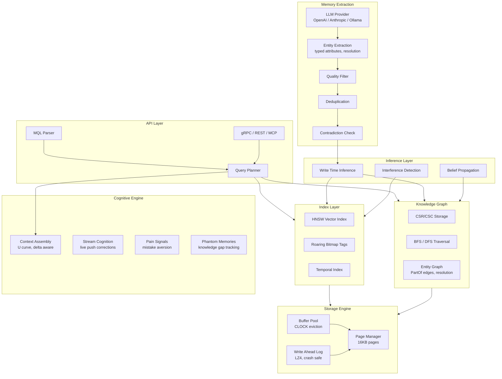

# MenteDB

> ⚠️ **Beta** — MenteDB is under active development. APIs may change between minor versions.

[](https://crates.io/crates/mentedb-core) [](https://docs.rs/mentedb-core) [](https://github.com/nambok/mentedb/actions/workflows/ci.yml) [](LICENSE) [](https://www.npmjs.com/package/mentedb) [](https://pypi.org/project/mentedb/)

**The Mind Database for AI Agents**

MenteDB is a purpose built database engine for AI agent memory. Not a wrapper around existing databases, but a ground up Rust storage engine that understands how AI/LLMs consume data.

> *mente* (Spanish): mind, intellect

## Installation

### Docker (fastest)

```bash
docker run -p 6677:6677 \
  -e MENTEDB_LLM_PROVIDER=openai \
  -e MENTEDB_LLM_API_KEY=sk-... \
  -v mentedb-data:/data \
  ghcr.io/nambok/mentedb:latest
```

### Rust (from source)

```bash
cargo install mentedb-server
mentedb-server --data-dir ./data
```

### Python SDK

```bash
pip install mentedb
```

### TypeScript SDK

```bash
npm install mentedb
```

### Integrations

```bash
pip install mentedb-langchain  # LangChain memory provider
pip install mentedb-crewai     # CrewAI memory provider
```

## Quick Start

**`process_turn` — one call does everything:**

```python
from mentedb import MenteDB

db = MenteDB("./my-agent-memory")
db.configure_llm(provider="anthropic", api_key="sk-...")

result = db.process_turn(
    user_message="I switched from PostgreSQL to SQLite for side projects",
    assistant_response="Got it, I'll suggest SQLite going forward.",
    turn_id=0,
)

# result.context       → relevant memories for your prompt
# result.facts_extracted → what was learned this turn
# result.contradiction_count → conflicting beliefs detected
# result.pain_warnings → things that went wrong before
```

One function call runs the full 14-step cognitive pipeline: embedding, speculative cache, hybrid search, pain signals, episodic storage, fact extraction, contradiction detection, sentiment analysis, and more.

> **Enrichment runs automatically in the background** — semantic facts, entity graphs,
> community summaries, and a user profile are built over time after each `process_turn`.

**Via MCP (zero code):**

```bash
npx mentedb-mcp@latest setup copilot  # or claude, cursor, vscode
```

Your AI assistant calls `process_turn` automatically every turn.

**Embed in Rust:**

```rust
use mentedb::{MenteDb, process_turn::{ProcessTurnInput, DeltaTracker}};

let db = MenteDb::open("./my-agent-memory")?;
let mut delta = DeltaTracker::default();
let result = db.process_turn(&ProcessTurnInput {
    user_message: "I switched from PostgreSQL to SQLite".into(),
    assistant_response: Some("Got it!".into()),
    turn_id: 0,
    project_context: None,
    agent_id: None,
}, &mut delta)?;
```

## Why MenteDB?

Every database ever built assumes the consumer can compensate for bad data organization. **AI can't.** A transformer gets ONE SHOT, a single context window, a single forward pass. MenteDB is a *cognition preparation engine* that delivers perfectly organized knowledge because the consumer has no ability to reorganize it.

### The Memory Quality Problem

Most AI memory tools store everything and retrieve by similarity. The result: **context windows full of noise.** Studies show up to 97% of automatically stored memories are irrelevant.

MenteDB solves this with **write time intelligence:**

1. **LLM Powered Extraction** parses conversations and extracts only what matters: decisions, preferences, corrections, facts, entities
2. **Entity-Centric Memory** extracts structured entities (people, pets, places, events) with typed attributes and links them to related memories via knowledge graph edges — so "bought a collar for my Golden Retriever" remembers the breed, not just the collar
3. **Quality Filtering** rejects low confidence extractions before they hit storage
4. **Deduplication** checks embedding similarity against existing memories
5. **Contradiction Detection** flags when new information conflicts with existing beliefs
6. **Belief Propagation** cascades updates when facts change

The result: a clean, curated memory that actually helps the AI perform better.

### What Makes MenteDB Different

| Feature | Traditional DBs | Vector DBs | MenteDB |
|---------|----------------|------------|---------|
| Storage model | Tables/Documents | Embeddings | Memory nodes (embeddings + graph + bi-temporal) |
| Entity understanding | Manual schemas | None | **Auto-extracted typed entities with graph edges** |
| Query result | Raw data | Similarity scores | **Token budget optimized context** |
| Memory quality | Manual | None | **LLM extract + quality filter + dedup + contradiction** |
| Retrieval strategy | Index scan | Single-pass kNN | **Adaptive multi-pass + entity graph expansion** |
| Understands AI attention? | No | No | **Yes, U curve ordering** |
| Tracks what AI knows? | No | No | **Epistemic state tracking** |
| Multi-agent isolation? | Schema level | Collection level | **Memory spaces with ACLs** |
| Updates cascade? | Foreign keys | No | **Belief propagation** |

### Core Features

- **Automatic Memory Extraction** LLM powered pipeline extracts structured memories from raw conversations
- **Entity-Centric Memory** Extracts typed entities (person, pet, place, event, item, organization) with structured attributes. Entity resolution merges attributes across mentions. Graph edges link memories to the entities they reference
- **Adaptive Multi-Pass Retrieval** Engine-level 3-pass search (instant recall → active search → deep dig) with progressively increasing depth, reciprocal rank fusion, and entity graph expansion
- **Write Time Intelligence** Quality filter, deduplication, and contradiction detection at ingest
- **LLM Powered Cognitive Inference** CognitiveLlmService judges whether new memories invalidate, update, or are compatible with existing ones (supports Anthropic, OpenAI, Ollama)
- **Bi-Temporal Validity** Memories and edges carry `valid_from`/`valid_until` timestamps. Temporal invalidation instead of deletion. Point-in-time queries via `recall_similar_at(embedding, k, timestamp)`
- **Attention Optimized Context Assembly** Respects the U curve (critical data at start/end of context)
- **Belief Propagation** When facts change, downstream beliefs are flagged for re evaluation
- **Delta Aware Serving** Only sends what changed since last turn (90% reduction in memory retrieval tokens over 20 turns)
- **Cognitive Memory Tiers** Working, Episodic, Semantic, Procedural, Archival
- **Knowledge Graph** CSR/CSC graph with BFS/DFS traversal and contradiction detection
- **Memory Spaces** Multi agent isolation with per space ACLs
- **MQL** Mente Query Language with full boolean logic (AND, OR, NOT) and ordering (ASC/DESC)
- **Type Safe IDs** MemoryId, AgentId, SpaceId newtypes prevent accidental mixing
- **Binary Embeddings** Base64 encoded storage, 65% smaller than JSON arrays
- **Local Candle Embeddings** Zero config semantic search using all-MiniLM-L6-v2 (384 dims), no API key required
- **gRPC + REST + MCP** Three integration paths for any use case

### Entity-Centric Memory

Most memory systems store flat text strings. When a user says *"I bought a collar for my Golden Retriever like Max"*, a flat system remembers the collar purchase but loses the breed. MenteDB extracts **structured entities** with typed attributes:

```
Entity: MAX (pet)
  breed: Golden Retriever
  ──linked to──> "User bought a collar for their dog Max"
  ──linked to──> "User takes Max to the park on weekends"
```

**How it works:**
1. **Extraction** — The LLM identifies entities (people, pets, places, events, items) and their attributes, even from incidental mentions
2. **Resolution** — Multiple mentions of the same entity are merged: "Max", "my dog", "the Golden Retriever" all resolve to one entity node
3. **Graph linking** — `PartOf` edges connect every memory that mentions an entity back to the entity node
4. **Search expansion** — When search hits an entity, the engine traverses its subgraph to surface all related memories

This means asking *"What breed is my dog?"* finds the entity MAX, follows its edges, and returns the breed attribute — even if no single memory explicitly says "my dog is a Golden Retriever".

### Performance Targets (10M memories)

| Operation | Target |
|-----------|--------|
| Point lookup | ~50ns |
| Multi-tag filter | ~10us |
| k-NN similarity search | ~5ms |
| Full context assembly | <50ms |
| Startup (mmap) | <1ms |

## Integration Options

### 1. MCP Server (AI Clients)

For Claude CLI, Copilot CLI, Cursor, Windsurf, and any MCP compatible client.

```bash
npx mentedb-mcp@latest setup copilot
```

Or install from crates.io if you prefer Rust:

```bash
cargo install mentedb-mcp
mentedb-mcp setup copilot
```

See [mentedb-mcp](https://github.com/nambok/mentedb-mcp) for setup, configuration, and the full list of 32 tools.

**Key tools:** `process_turn` (the primary API — one call per turn), `store_memory`, `search_memories`, `forget_memory`, `assemble_context`, `relate_memories`, `write_inference`, `get_cognitive_state`, and 20+ more covering knowledge graph, consolidation, and cognitive systems.

### 2. REST API

```bash
# Start the server
cargo run -p mentedb-server -- --data-dir ./data --jwt-secret-file ./secret.key

# Store a memory
curl -X POST http://localhost:6677/v1/memories \
  -H "Authorization: Bearer $TOKEN" \
  -d '{"agent_id": "...", "content": "User prefers dark mode", "memory_type": "semantic"}'

# Recall memories
curl -X POST http://localhost:6677/v1/query \
  -H "Authorization: Bearer $TOKEN" \
  -d '{"mql": "RECALL memories WHERE tag = \"preferences\" LIMIT 10"}'
```

### 3. gRPC

Bidirectional streaming for real time cognition updates. Proto file at `crates/mentedb-server/proto/mentedb.proto`.

### 4. SDKs

**Python:** `pip install mentedb`
```python
from mentedb import MenteDB

db = MenteDB("./agent-memory")
result = db.process_turn(
    user_message="I switched to Vim",
    assistant_response="Got it!",
    turn_id=0,
)
# result.context has relevant memories for your prompt
```

**TypeScript:** `npm install mentedb`
```typescript
import { MenteDB } from 'mentedb';

const db = new MenteDB('./agent-memory');
const result = await db.processTurn({
  userMessage: 'I switched to Neovim',
  assistantResponse: 'Noted!',
  turnId: 0,
});
// result.context has relevant memories for your prompt
```

**LangChain:** `pip install mentedb-langchain`
```python
from mentedb_langchain import MenteDBChatHistory

history = MenteDBChatHistory(data_dir="./memory", agent_id="my-agent")
history.add_user_message("I prefer dark mode")
history.add_ai_message("Noted!")
```

**CrewAI:** `pip install mentedb-crewai`
```python
from mentedb_crewai import MenteDBCrewMemory

memory = MenteDBCrewMemory(data_dir="./memory")
```

## Architecture



## Cognitive Engine

MenteDB isn't just a memory store — it's a cognitive engine that automatically maintains memory health. All cognitive features are wired into the core `MenteDb` facade and run automatically.

### Write Inference (automatic on `store()`)

Every time a memory is stored, the engine finds the 20 most similar existing memories and runs heuristic inference:

| Cosine Similarity | Action | What happens |
|-------------------|--------|-------------|
| **> 0.95** | Contradiction detected | Creates `Contradicts` edge, flags conflict |
| **> 0.85** | Supersedes old memory | Invalidates older memory (`valid_until` set), creates `Supersedes` edge |
| **0.6 – 0.85** | Related | Creates `Related` edge with similarity as weight |
| **< 0.6** | No action | Memories are independent |

For `Correction` type memories, the engine also halves the confidence of the corrected memory and propagates belief changes through the knowledge graph.

### Salience Decay (automatic on retrieval)

Memory relevance decays over time using an exponential formula:

```
decayed = salience × 2^(-Δt / half_life) + boost × ln(1 + access_count)
```

- **Half-life:** 7 days (configurable)
- **Access boost:** Frequently accessed memories resist decay
- **Retrieval blending:** Final score = 70% similarity + 30% decayed salience
- **Floor:** Memories never decay below 0.01

### Memory Consolidation (on-demand)

Similar memories can be merged into unified knowledge:

```rust
// Find clusters of similar, old memories eligible for merging
let candidates = db.find_consolidation_candidates(2, 0.8)?;

// Merge a cluster into a single Semantic memory
let consolidated_id = db.consolidate_cluster(&memory_ids)?;
// Source memories are invalidated (not deleted) with Derived edges
```

Eligibility: Episodic type, > 24 hours old, accessed > 2 times.

### Configuration

All cognitive features are enabled by default. Toggle individually:

```rust
use mentedb::{MenteDb, CognitiveConfig};

let config = CognitiveConfig {
    write_inference: true,        // auto-edges, contradiction detection
    decay_on_recall: true,        // time-based salience decay
    pain_tracking: true,          // recurring failure warnings
    interference_detection: true, // confusable memory detection
    phantom_tracking: true,       // missing knowledge gap detection
    speculative_cache: true,      // predictive context pre-assembly
    archival_evaluation: true,    // memory lifecycle management
    ..Default::default()
};
let db = MenteDb::open_with_config("./memory", config)?;
```

### Pain Registry

Track recurring failures and surface warnings when similar contexts arise:

```rust
db.record_pain(PainSignal { trigger_keywords: vec!["deploy".into()], .. });
let warnings = db.get_pain_warnings(&["deploy".into(), "production".into()]);
```

### Interference Detection

Find confusable memories and generate disambiguation hints:

```rust
let pairs = db.detect_interference(&retrieved_memories);
for pair in &pairs {
    println!("Confusable: {} ({})", pair.disambiguation, pair.similarity);
}
```

### Phantom Tracking

Detect referenced-but-missing knowledge gaps:

```rust
db.register_entities(&["PostgreSQL", "Redis"]);
let phantoms = db.detect_phantoms("Deploy to Kubernetes", &known, turn_id);
```

### Speculative Cache

Pre-fetch context for predicted topics:

```rust
let predictions = db.predict_next_topics();
db.pre_assemble_speculative(predictions, |topic| { /* build context */ });
let hit = db.try_speculative_hit("database design", Some(&query_embedding));
```

### Entity Resolution

Resolve aliases to canonical names:

```rust
db.add_entity_alias("JS", "JavaScript", 0.95);
let resolved = db.resolve_entity("JS"); // → "javascript"
```

### Memory Compression

Compress verbose memories for token efficiency:

```rust
let compressed = db.compress_memory(&memory);
println!("Ratio: {:.0}%", compressed.compression_ratio * 100.0);
```

### Archival Evaluation

Evaluate memory lifecycle decisions (keep, archive, delete):

```rust
let decisions = db.evaluate_archival_global()?;
for (id, decision) in decisions {
    match decision {
        ArchivalDecision::Archive => { /* move to cold storage */ },
        ArchivalDecision::Delete => { db.forget(id)?; },
        _ => {}
    }
}
```

## Sleeptime Enrichment

MenteDB includes a 4-phase background enrichment pipeline that automatically converts raw conversations into structured knowledge. It runs after `process_turn` when enough new memories accumulate — no manual trigger needed.

| Phase | What it does |
|-------|-------------|
| **Batch LLM Extraction** | Converts episodic memories into semantic facts and entity nodes |
| **Entity Linking** | Resolves duplicates and aliases (e.g., "JS" ↔ "JavaScript") via rules + LLM |
| **Community Detection** | Groups related entities by category and generates LLM summaries |
| **User Model** | Builds an always-available user profile from accumulated knowledge |

Enrichment results feed back into `process_turn` context retrieval — richer semantic memories, entity graphs, community summaries, and the user profile all improve recall quality. The pipeline is idempotent and tracks provenance via `source:enrichment` tags and `Derived` edges.

**Requires an LLM provider** (OpenAI, Anthropic, or Ollama). Without one, the engine works perfectly — enrichment just doesn't run. See [LLM Extraction Config](#llm-extraction-config) for setup.

```rust
// Enable enrichment in Cargo.toml:
// mentedb = { version = "0.8", features = ["enrichment"] }

use mentedb::enrichment::{run_enrichment, EnrichmentResult};

let result = run_enrichment(&db, config, &embedder, Some(&cognitive_llm), turn_id).await;
println!("Stored {} memories, linked {} entities", result.memories_stored, result.sync_linked + result.llm_linked);
```

## Crates

MenteDB is organized as a Cargo workspace with 13 crates:

| Crate | Description |
|-------|-------------|
| `mentedb` | Facade crate with full cognitive engine (12 subsystems wired in) |
| `mentedb-core` | Types (MemoryNode, MemoryEdge), newtype IDs, errors, config |
| `mentedb-storage` | Page based storage engine with crash safe WAL, buffer pool, LZ4 |
| `mentedb-index` | HNSW vector index (bounded, concurrent), roaring bitmaps, temporal index |
| `mentedb-graph` | CSR/CSC knowledge graph with BFS/DFS and contradiction detection |
| `mentedb-query` | MQL parser with AND/OR/NOT, ASC/DESC ordering |
| `mentedb-context` | Attention aware context assembly, U curve ordering, delta tracking |
| `mentedb-cognitive` | Write inference, belief propagation, pain signals, phantom memories, speculative cache |
| `mentedb-consolidation` | Temporal decay, memory consolidation, salience management, archival |
| `mentedb-embedding` | Embedding provider abstraction |
| `mentedb-extraction` | LLM powered memory extraction pipeline |
| `mentedb-server` | REST + gRPC server with JWT auth, space ACLs, rate limiting |
| `mentedb-replication` | Raft based replication (experimental) |

## Security

MenteDB includes production security features:

- **JWT Authentication** on all REST and gRPC endpoints
- **Agent Isolation** JWT claims enforce per agent data access
- **Space ACLs** fine grained permissions for multi agent setups
- **Admin Keys** separate admin authentication for token issuance
- **Rate Limiting** per agent write rate enforcement
- **Embedding Validation** dimension mismatch returns errors, not panics

```bash
# Production deployment
export MENTEDB_JWT_SECRET="your-secret-here"
export MENTEDB_ADMIN_KEY="your-admin-key"
export MENTEDB_LLM_PROVIDER="openai"
export MENTEDB_LLM_API_KEY="sk-..."

mentedb-server --require-auth --data-dir /var/mentedb/data
```

## LLM Extraction Configuration

Configure the extraction pipeline via environment variables:

| Variable | Description | Default |
|----------|-------------|---------|
| `MENTEDB_LLM_PROVIDER` | openai, anthropic, ollama, none | none |
| `MENTEDB_LLM_API_KEY` | API key for the provider | |
| `MENTEDB_LLM_MODEL` | Model name | Provider default |
| `MENTEDB_LLM_BASE_URL` | Custom base URL (Ollama, proxies) | Provider default |
| `MENTEDB_EXTRACTION_QUALITY_THRESHOLD` | Min confidence to store (0.0 to 1.0) | 0.7 |
| `MENTEDB_EXTRACTION_DEDUP_THRESHOLD` | Similarity threshold for dedup (0.0 to 1.0) | 0.85 |

## MQL Examples

```sql
-- Vector similarity search
RECALL memories NEAR [0.12, 0.45, 0.78, 0.33] LIMIT 10

-- Boolean filters with OR and NOT
RECALL memories WHERE type = episodic AND (tag = "backend" OR tag = "frontend") LIMIT 5
RECALL memories WHERE NOT tag = "archived" ORDER BY salience DESC

-- Content similarity
RECALL memories WHERE content ~> "database migration strategies" LIMIT 10

-- Graph traversal
TRAVERSE 550e8400-e29b-41d4-a716-446655440000 DEPTH 3 WHERE edge_type = caused

-- Consolidation
CONSOLIDATE WHERE type = episodic AND accessed < "2024-01-01"
```

## Docker

```bash
# Using the published image
docker run -p 6677:6677 \
  -e MENTEDB_JWT_SECRET=your-secret \
  -e MENTEDB_LLM_PROVIDER=openai \
  -e MENTEDB_LLM_API_KEY=sk-... \
  -v mentedb-data:/data \
  ghcr.io/nambok/mentedb:latest

# Or build from source
docker build -t mentedb .
docker run -p 6677:6677 \
  -e MENTEDB_JWT_SECRET=your-secret \
  -v mentedb-data:/data \
  mentedb
```

Or with docker-compose:

```bash
docker-compose up -d
```

## Benchmarks

### Quality Benchmarks (5/5 passing)

| Test | Result | Key Metric |
|------|--------|------------|
| Stale Belief | PASS | Superseded memories correctly excluded via graph edges |
| Delta Savings | PASS | 90.7% reduction in memory retrieval tokens over 20 turns |
| Sustained Conversation | PASS | 100 turns, 3 projects, 0% stale returns, 0.29ms insert |
| Attention Budget | PASS | U-curve ordering maintains 100% LLM compliance |
| Noise Ratio | PASS | 100% useful vs 80% naive, +20pp improvement |

### LLM Accuracy Benchmarks (62 cases)

MenteDB's cognitive layer uses LLM judgment for memory invalidation, contradiction detection, and topic canonicalization. We maintain a curated test suite of 62 cases to validate accuracy across providers.

| Provider | Invalidation (23) | Contradiction (24) | Topic (15) | **Total** |
|----------|-------------------|-------------------|------------|-----------|
| Anthropic Claude Sonnet 4 | 100% | 100% | 100% | **100% (62/62)** |
| Ollama llama3.1 8b | 87% | 66.7% | 93.3% | **80.6% (50/62)** |
| Ollama llama3.2 3B | 78.3% | 58.3% | 80% | **71% (44/62)** |

**Three tier design:** Works without any LLM (heuristics only), works well with a free local model via Ollama, and achieves perfect accuracy with a cloud API. We strongly recommend configuring your own LLM provider for the best experience.

```bash
# Run the accuracy benchmark yourself
LLM_PROVIDER=anthropic LLM_API_KEY=sk-ant-... \
  cargo test -p mentedb-extraction --test llm_accuracy -- --ignored --nocapture
```

### LongMemEval Benchmark

[LongMemEval](https://arxiv.org/abs/2410.10813) is the standard benchmark for long-term conversational memory systems. It tests 500 questions across 7 categories using real multi-session conversation histories.

**MenteDB v0.4.2** — 500 questions, judged by gpt-4o-2024-08-06 (official):

| Category | Score | Questions |
|----------|-------|-----------|
| Single-session (user) | **95.3%** | 70 |
| Abstention | **86.7%** | 30 |
| Multi-session | **83.5%** | 133 |
| Single-session (preference) | **83.3%** | 30 |
| Temporal reasoning | **81.9%** | 133 |
| Knowledge update | **79.2%** | 78 |
| Single-session (assistant) | **73.2%** | 56 |
| **Task-averaged** | **83.3%** | |
| **Overall** | **83.0%** | 500 |

**Setup:** GPT-4o-mini extraction, text-embedding-3-small embeddings, Claude Sonnet reader. No benchmark files modified — all improvements are engine-side retrieval and synthesis.

```bash
# Run it yourself
cd benchmarks/longmemeval
bash run_full_benchmark.sh 0

# Evaluate
OPENAI_API_KEY=... python3 evaluate.py results/hypotheses_full.jsonl
```

### 10K Scale Test (OpenAI text-embedding-3-small)

| Metric | Value |
|--------|-------|
| Total memories | 10,000 |
| Avg insert | 457ms (includes OpenAI API round trip) |
| Avg search at 10K | 431ms |
| Belief changes | 6/6 correctly tracked |
| Stale beliefs returned | 0 |

### Candle (Local) vs OpenAI Embedding Quality

| Metric | Candle (all-MiniLM-L6-v2) | OpenAI (text-embedding-3-small) |
|--------|---------------------------|----------------------------------|
| Retrieval accuracy | 62% (5/8) | Requires API key to compare |
| Avg search | 41ms | 431ms (includes API latency) |
| Setup required | None (auto-downloads model) | OPENAI_API_KEY |
| Cost | Free | ~$0.02 per 1M tokens |

Candle provides good quality for zero-config local use. OpenAI offers higher accuracy for production workloads. Run `python3 benchmarks/candle_vs_openai.py` with OPENAI_API_KEY set to get a head-to-head comparison.

### Performance Benchmarks (Criterion)

| Benchmark | 100 | 1,000 | 10,000 |
|-----------|-----|-------|--------|
| Insert throughput | 13ms | 243ms | 2.65s |
| Context assembly | 218us | 342us | 696us |

Context assembly stays sub-millisecond even at 10,000 memories.

### Token Efficiency

MenteDB's context assembler uses purpose-built serialization formats instead of dumping raw JSON into context windows. Measured by [`token_efficiency`](crates/mentedb/examples/token_efficiency.rs):

**Format comparison** (25 memories, same content):

| Format | Tokens | vs Raw JSON |
|--------|-------:|------------:|
| Raw JSON | 947 | — |
| Structured (markdown) | 576 | 1.6x fewer |
| **Compact (pipe-delimited)** | **414** | **2.3x fewer** |

**Multi-turn delta serving** (20-turn conversation):

| Metric | Tokens |
|--------|-------:|
| Full retrieval (cumulative) | 9,863 |
| Delta serving (cumulative) | 2,004 |
| **Savings** | **79.7%** |

Delta serving only sends memories that changed since the last turn. Early turns have overhead from the delta header, but by turn 10+ savings exceed 85% per turn.

**Memory density** (memories that fit within a serialized output budget):

| Budget | Compact | Structured | Raw JSON |
|-------:|--------:|-----------:|---------:|
| 4,096 | 223 | 166 | 218 |
| 8,192 | 448 | 333 | 436 |

```bash
# Run it yourself
cargo run --example token_efficiency -p mentedb
```

### Running Benchmarks

```bash
# Engine tests (no LLM required)
python3 benchmarks/run_all.py --no-llm

# Full suite (requires ANTHROPIC_API_KEY or OPENAI_API_KEY)
python3 benchmarks/run_all.py

# Criterion performance benchmarks
cargo bench
```

## Building

```bash
cargo build              # Build all crates
cargo test               # Run 477+ tests
cargo clippy             # Lint
cargo bench              # Benchmarks
cargo doc --open         # Documentation
```

## Contributing

See [CONTRIBUTING.md](CONTRIBUTING.md) for guidelines.

Found a bug or have a feature request? [Open an issue](https://github.com/nambok/mentedb/issues).

## License

Apache 2.0, see [LICENSE](LICENSE) for details.
