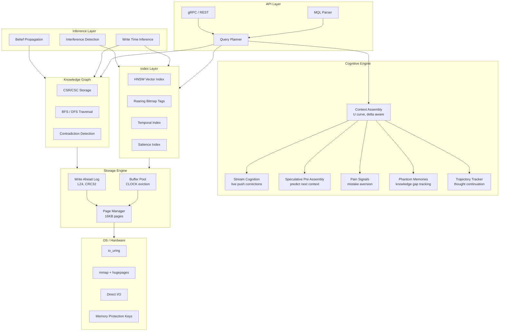

# MenteDB

**The Mind Database for AI Agents**

MenteDB is a purpose built database engine for AI agent memory. Not a wrapper around existing databases, but a ground up Rust storage engine that understands how AI/LLMs consume data.

> *mente* (Spanish): mind, intellect

## Why MenteDB?

Every database ever built assumes the consumer can compensate for bad data organization. **AI can't.** A transformer gets ONE SHOT, a single context window, a single forward pass. MenteDB is a *cognition preparation engine* that delivers perfectly organized knowledge because the consumer has no ability to reorganize it.

### What Makes MenteDB Different

| Feature | Traditional DBs | Vector DBs | MenteDB |
|---------|----------------|------------|---------|
| Storage model | Tables/Documents | Embeddings | Memory nodes (embeddings + graph + temporal + attributes) |
| Query result | Raw data | Similarity scores | **Token budget optimized context windows** |
| Understands AI attention? | No | No | **Yes, attention aware ordering** |
| Tracks what AI knows? | No | No | **Yes, epistemic state tracking** |
| Updates cascade? | Foreign keys | No | **Yes, belief propagation** |
| Multi-agent isolation? | Schema level | Collection level | **Memory spaces with MPK accelerated isolation** |

### Core Features

- **Unified Memory Representation** Embeddings + graph + temporal + attributes in one primitive
- **Attention Optimized Context Assembly** Respects the U curve (critical data at start/end)
- **Belief Propagation** When facts change, downstream beliefs are flagged for re evaluation
- **Delta Aware Serving** Only sends what changed since last turn (40-60% token savings)
- **Cognitive Memory Tiers** Working, Episodic, Semantic, Procedural, Archival
- **Token Efficient Serialization** 3x more information per token vs JSON
- **Memory Spaces** True multi agent isolation with hardware accelerated protection
- **MQL** Mente Query Language designed for memory retrieval

### Performance Targets (10M memories)

| Operation | Target |
|-----------|--------|
| Point lookup | ~50ns |
| Multi-tag filter | ~10μs |
| k-NN similarity search | ~5ms |
| Full context assembly | <50ms |
| Startup (mmap) | <1ms |

## Architecture



## Building

```bash
cargo build
cargo test
```

## License

Apache 2.0, see [LICENSE](LICENSE) for details.
